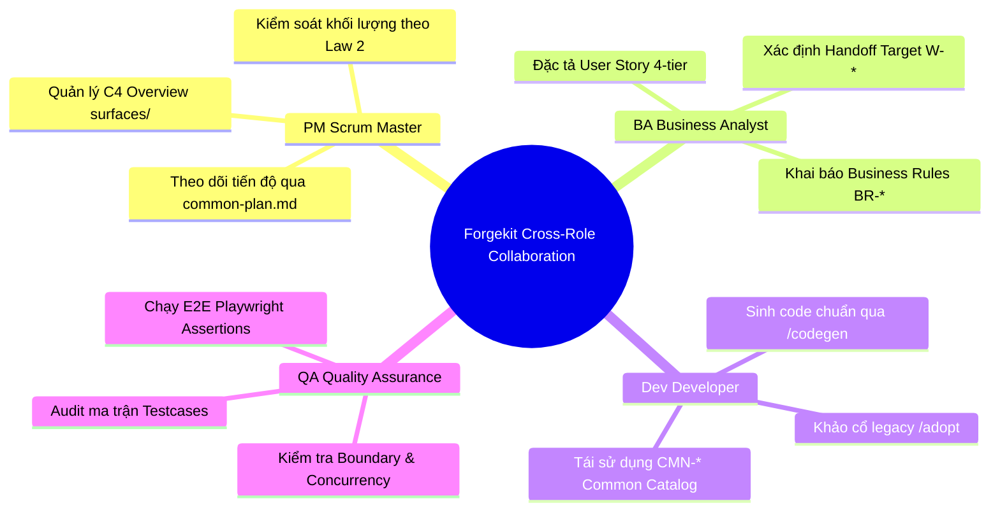

<!-- docskit-catalog -->
**[Danh mục tài liệu](CATALOG.md)**
<!-- /docskit-catalog -->

# Forgekit — Enterprise AI Engineering Toolkit

---

## 💡 Giới Thiệu & Triết Lý Cốt Lõi

**Forgekit** là bệ phóng AI Engineering cho đội ngũ phát triển phần mềm doanh nghiệp, được xây dựng dựa trên kiến trúc tiên phong: **Hybrid LLM + Deterministic Script Interlock**.

```
┌────────────────────────────────────────────────────────────────────────────────────────┐
│  HỆ THỐNG FORGEKIT (HYBRID LLM + DETERMINISTIC SCRIPT INTERLOCK)                      │
├────────────────────────────────────────────────────────────────────────────────────────┤
│  1. PHÂN CÔNG TRÁCH NHIỆM RẠCH RÒI:                                                   │
│     • Deterministic Audit Script ➔ Kiểm tra LƯỢNG (Kiểm định sự tồn tại của các trường)│
│     • AI Agent Reasoning (LLM)  ➔ Kiểm tra CHẤT (Phân tích logic, nghiệp vụ & User Story)│
│                                                                                        │
│  2. BỘ BẢO VỆ BẢN QUYỀN & CHỐNG RÁC LEGACY:                                            │
│     • 2-Tier Legacy Audit ➔ Phân định Rà soát Màn hình (Page-local) & Quy trình (Cross-flow)│
│     • Common Catalog Discovery ➔ Tự động phát hiện & gom nhóm linh kiện/hàm lặp (CMN-*) │
│     • Anti-Copy-Paste Guard ➔ Bắt buộc tái sử dụng Common Code, cấm nhân bản rác cũ     │
│                                                                                        │
│  3. KỶ LUẬT VẬN HÀNH SCRUM AGILE (LAWS 1-7):                                           │
│     • Law 2 Threshold Interlock ➔ Tự động ngắt chat khi quá 10 items, lập Plan chia Phase│
│     • Zone-Based Multi-Turn ➔ Chia nhỏ màn hình theo Zone nội dung, chống Lost-in-middle │
└────────────────────────────────────────────────────────────────────────────────────────┘
```

---

## ⚡ Cài Đặt Nhanh (One-Liner)

Dành cho Linux / WSL. Yêu cầu hệ thống: `Node.js >= 22` và `git`.

```bash
curl -fsSL https://raw.githubusercontent.com/ShanYuCoder/forgekit/main/install.sh | bash
```

---

## 📋 Mục Lục (Table of Contents)

1. [Tổng Quan Đánh Giá Vận Hành (Operational Assessment)](#-1-tổng-quan-đánh-giá-vận-hành)
2. [Review Chi Tiết Theo 3 Case Sử Dụng Thực Tế](#-2-review-chi-tiết-theo-3-case-sử-dụng-thực-tế)
3. [Mô Hình Nhân Sự T-Shaped Agile & Tương Tác Cross-Role](#-3-mô-hình-nhân-sự-t-shaped-agile--tương-tác-cross-role)
4. [Định Hướng Phát Triển Tương Lai (Future Roadmap)](#-4-định-hướng-phát-triển-tương-lai-future-roadmap)
5. [Tài Liệu Chi Tiết & Hướng Dẫn Vận Hành](#-5-tài-liệu-chi-tiết--hướng-dẫn-vận-hành)

---

## 🏆 1. TỔNG QUAN ĐÁNH GIÁ VẬN HÀNH

Hệ thống Forgekit được thiết kế nhằm chuẩn hóa toàn bộ vòng đời phát triển phần mềm trong doanh nghiệp, đảm bảo tính kỷ luật và sự nhất quán tuyệt đối giữa Tài liệu đặc tả (SSOT) và Mã nguồn thực tế:

| Tiêu chí Vận hành | Đánh giá Kỹ thuật Chi tiết |
|---|---|
| **Bảo vệ Kiến trúc & An toàn Codebase** | • Sử dụng bộ script kiểm định tĩnh (Static Audit Scripts) chạy 0-dependency với tham số `--type` độc lập.<br>• Loại bỏ hoàn toàn rủi ro AI tự suy đoán (Hallucination) hoặc tự bỏ sót các trường bắt buộc.<br>• Phân định rạch ròi giữa kiểm tra định lượng (Script) và kiểm định nội dung nghiệp vụ (Agent). |
| **Hỗ trợ Scrum Agile & T-Shaped Roles** | • Phá vỡ rào cản giao tiếp giữa PM, BA, Dev và QA thông qua ngôn ngữ đặc tả YAML/Markdown chuẩn hóa.<br>• Tự động ngắt chat khi khối lượng yêu cầu vượt quá ngưỡng 10 items (Law 2), chuyển sang cơ chế lập `common-plan.md` chia nhỏ theo Phase để review. |
| **Kiểm định Tự động & Bảo vệ Tech Debt** | • Tự động gắn tag các lỗ hổng kỹ thuật (`#missing_info`, `QA-item`, `[LEGACY_GAP]`).<br>• Tự động quét và phát hiện các mẫu code copy-paste từ dự án cũ để gom nhóm thành bộ thư viện dùng chung `CMN-*`. |

---

## 🏢 2. REVIEW CHI TIẾT THEO 3 CASE SỬ DỤNG THỰC TẾ

### 🟢 CASE 1: Phát Triển Mới Từ Đầu (Greenfield Project)
- **Đặc trưng**: Tốc độ phát triển cực nhanh | Độ chuẩn xác nghiệp vụ tối đa (99%).
- **Cơ chế Vận hành**:
  1. BA/PM sử dụng lệnh `/spec` để phác thảo màn hình ➔ Agent tự động nhận diện Page Type (`list`, `create`, `detail`, `admin-crud`, `auth`).
  2. Kích hoạt `audit-bundle-gaps.mjs --type <pageType>`: Tự động điền các trường required trong `gaps[]` và kích hoạt AskQuestion Modal cho các tùy chọn optional (`confirms[]`).
  3. Áp dụng **Zone-Based Multi-Turn Analysis**: Chia màn hình thành các Zone linh động (Header, Search Toolbar, Table/Form, Footer Actions) để phân tích sâu từng zone trong turn riêng lẻ.
  4. Dev thực hiện `/prototype` hoặc `/codegen` sinh code ➔ QA kích hoạt `/audit:testcase` để kiểm thử ma trận Boundary & Concurrency.

### 🟡 CASE 2: Dựa Trên Legacy Để Phát Triển Mới (Modernization / Re-Platforming)
- **Đặc trưng**: Độ an toàn kiến trúc rất cao | Bảo vệ hệ thống mới khỏi mã rác cũ.
- **Cơ chế Vận hành**:
  1. Kích hoạt lệnh `/adopt` ở chế độ **Common Analysis Mode**: AI quét toàn bộ cấu trúc code legacy (FE Router/Components + BE Services/Utils/DTOs).
  2. Tự động gom nhóm các đoạn code/UI lặp lại thành **Common Catalog Candidates (`CMN-UI-*`, `CMN-API-*`, `CMN-DTO-*`)**.
  3. Với trường hợp dev cũ nhân bản cả màn hình (ví dụ `CreateUser` vs `EditUser`), hệ thống phát cảnh báo **Whole Page Duplication Warning**, khuyến nghị gộp thành 1 Spec đa chế độ (`mode: create | edit`).
  4. Kích hoạt **Anti-Copy-Paste Guard**: Bắt buộc Dev/BA khi thiết kế màn mới phải tái sử dụng mã `CMN-*` trong Common Catalog, nghiêm cấm bê code lẻ tẻ từ dự án cũ.
  5. Áp dụng **2-Tier Legacy Audit**: 
     - *Tier 1 (Page-local)*: Rà soát validate nội bộ màn hình (`/legacy /spec`).
     - *Tier 2 (Cross-flow)*: Rà soát đứt đoạn quy trình và lệch schema giữa các màn hình (`/legacy /flow`).

### 🔵 CASE 3: Bảo Trì & Phát Triển Hệ Thống Cũ (Legacy Maintenance)
- **Đặc trưng**: Mức độ tương thích tuyệt đối với Tech Stack cũ.
- **Cơ chế Vận hành**:
  1. Khởi tạo dự án qua `forgekit init` chọn profile **Custom / Existing Base**.
  2. Chỉ định **Golden Sample** (màn hình hình mẫu đẹp nhất của dự án cũ).
  3. Chạy `forgekit build-template-code`: Hệ thống tự động bóc tách DNA dự án, học danh mục UI library (Element Plus, Ant Design, Vuetify...) và sinh `design.registry.json` kèm Lexicon tùy biến.
  4. Nạp Lexicon vào SQLite Local ArtifactGraph ➔ **Dập tắt hoàn toàn báo đỏ giả (`#needs-component`)**, cho phép sinh code bảo trì chuẩn phong cách dự án cũ mà không bị vỡ giao diện.

---

## 🎯 3. MÔ HÌNH NHÂN SỰ T-SHAPED AGILE & TƯƠNG TÁC CROSS-ROLE

Trong một đội ngũ Scrum Agile vận hành theo mô hình nhân sự **T-Shaped** (Thành viên có chuyên môn sâu một mảng nhưng có khả năng làm việc liên mảng), Forgekit đóng vai trò là **chất kết dính giao tiếp**, loại bỏ hoàn toàn các điểm nghẽn (Siloed Bottlenecks):



### 🔄 Luồng Tương Tác Giữa Các Role Trong Sprint:

1. **PM / Scrum Master (Quản Lý Tiến Độ & Phạm Vi)**:
   - Theo dõi bức tranh tổng thể hệ thống qua cấu trúc C4 Architecture trong `/overview`.
   - Quản lý các đợt phát triển linh kiện dùng chung qua `common-plan.md`.
   - Được bảo vệ bởi **Law 2 (Workload Threshold)**: AI không bao giờ tự ý nghĩ ra quá 10 câu hỏi spam chat mà tự động đóng gói thành Plan chia Phase rõ ràng để PM duyệt.

2. **BA (Business Analyst - Đặc Tả Nghiệp Vụ)**:
   - Sử dụng lệnh `/spec` và `/flow` (`/business-process`) để tạo tài liệu đặc tả SSOT.
   - Nhận sự hỗ trợ từ Script Audit: Tự động gợi ý các kịch bản ngoại lệ 4-tier (`onBusinessErrors`, `onSecurityErrors`, `onSystemErrors`).

3. **Dev (Developer - Lập Trình & Tái Sử Dụng)**:
   - Đóng vai trò khảo cổ dự án cũ bằng `/adopt` và `/legacy /spec`.
   - Tận dụng triệt để bộ linh kiện **Common Catalog (`CMN-*`)** để sinh code nhanh thông qua `/codegen` mà không cần viết lại từ đầu.
   - Kiểm tra phản biện thiết kế trước khi gõ code thông qua lệnh `/grill-dev`.

4. **QA (Quality Assurance - Thẩm Định & Kiểm Thử)**:
   - Chạy lệnh `pnpm run audit:testcase` để đảm bảo 100% kịch bản kiểm thử đã bao phủ các kịch bản khởi tạo (Initial Load), Thẩm định form (Validation), Nộp thành công (Happy Path), Ngoại lệ 5xx/409, Ma trận giá trị biên (Boundary Analysis) và Phân quyền RBAC.

### 💡 Giải Quyết Bài Toán Điểm Nghẽn Nhân Sự (Cross-Role Synergy):
- **Khi BA quá tải**: Dev có thể gõ `/spec` thô, Script Audit sẽ tự động chỉ ra các trường thiếu để Dev bổ sung theo đúng chuẩn BA.
- **Khi Dev cần verify nghiệp vụ**: Dev chạy `/grill-dev`, AI Agent sẽ đóng vai BA/QA để phản biện từng Zone của màn hình.
- **Khi QA cần viết E2E Test**: QA dựa trực tiếp vào file Spec YAML đã được gắn sẵn TestIDs và Semantic Assertions để tự động sinh mã kiểm thử Playwright.

---

## 🔍 4. ĐỊNH HƯỚNG PHÁT TRIỂN TƯƠNG LAI (FUTURE ROADMAP)

Để tiếp tục nâng cao hiệu quả vận hành cho các đội ngũ phần mềm enterprise, lộ trình phát triển tiếp theo của Forgekit tập trung vào 2 tính năng trọng tâm:

1. **📊 Metrics Dashboard CLI (`forgekit metrics`)**:
   - Tự động thống kê và xuất báo cáo chỉ số tái sử dụng Common Code.
   - Đo lường mức độ giảm thiểu Tech Debt và tỷ lệ % bao phủ linh kiện `CMN-*` giữa các dự án.

2. **🖼️ Visual Regression Diff cho Legacy Archaeology**:
   - Tích hợp công cụ so sánh trực quan giao diện UI giữa hệ thống cũ (Legacy) và bản thiết kế mới (Prototype).
   - Tự động phát hiện các điểm sai lệch về bố cục, màu sắc và typography ngay ở giai đoạn Đặc tả.

---

## 📚 5. TÀI LIỆU CHI TIẾT & HƯỚNG DẪN VẬN HÀNH

Toàn bộ thông tin hướng dẫn chuyên sâu đã được phân tách thành các cuốn Sổ tay SSOT:

1. 👉 **[Hướng dẫn Quét Khảo cổ Legacy & Đề xuất Common Catalog](./docs/1-guide/legacy-adoption-common-workflow.md)**
2. 👉 **[Hướng dẫn Quy trình Spec, Audit Script & Grill cho Dự án mới](./docs/1-guide/spec-grill-audit-workflow.md)**
3. 👉 **[Sổ tay Hướng dẫn Dự án Custom Base / Maintain](./docs/1-guide/custom-base-workflow.md)**
4. 👉 **[Danh mục Mục lục Tài liệu Hệ thống (CATALOG.md)](./CATALOG.md)**

---

**🔥 Dành cho Đội ngũ Phần mềm:** Mọi thứ đã được chuẩn hóa khép kín. Hãy cài đặt Forgekit ngay hôm nay để trải nghiệm quy trình AI Engineering kỷ luật và hiện đại!
