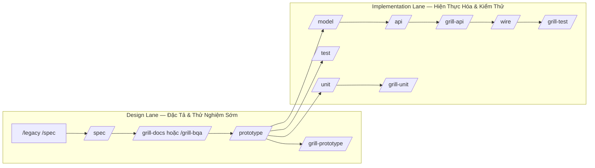

# Feature Artifact AI Workflow

> Tài liệu hướng dẫn phương thức làm việc và phối hợp giữa thành viên (BA, QA, Dev) và AI trong toàn bộ vòng đời phát triển tính năng (Feature Lifecycle).

---

## 1. Tầm Nhìn & Triết Lý Cốt Lõi

### AI Phục Vụ Con Người — Không Phải Con Người Phục Vụ AI
- **Không bắt member viết đầu vào phức tạp:** Team vẫn bắt đầu bằng các yêu cầu thô: gạch đầu dòng, ghi chú ngắn, ảnh chụp màn hình, mô tả user story cơ bản hoặc mã nguồn legacy cần bóc tách behavior.
- **AI đảm nhiệm chuẩn hóa kỹ thuật:** AI tiếp nhận input thô, xử lý và tạo ra cấu trúc kỹ thuật chuẩn mực (YAML Bundle, Data Dictionary, State Matrix, Validation Rules, Test Scenarios).
- **Con người review trực quan & ra quyết định:** Member (BA/QA/Dev) không cần đọc các file cấu hình máy phức tạp mà tập trung review bản Markdown trực quan và tương tác trực tiếp trên màn hình Prototype.
- **Safety Net tự động:** Testcase và kịch bản E2E được AI sinh từ sớm, giúp QA thoát khỏi vòng lặp regression thủ công lặp đi lặp lại để tập trung vào các ca kiểm thử chuyên sâu.

```text
Requirement thô (gạch đầu dòng / ảnh / legacy code)
  ↓
AI hỗ trợ chuẩn hóa cấu trúc
  ↓
Prototype UI + User Story Markdown + SSOT Data Dictionary
  ↓
Human Review (BA / QA / Dev trải nghiệm & góp ý)
  ↓
Sinh mã nguồn: E2E Playwright / Backend API / Frontend Integration / Unit Test
  ↓
Release an toàn với Safety Net tự động
```

---

## 2. Vì Sao Dùng Song Hành YAML & Markdown?

| Tiêu chí | YAML (Lớp xử lý của Máy) | Markdown (Lớp trải nghiệm của Người) |
|---|---|---|
| **Đối tượng sử dụng** | AI Agent, Codegen Engine, CI/CD Pipeline | BA, QA, Dev, Product Owner, Stakeholders |
| **Đặc tính** | Dữ liệu có cấu trúc phân cấp, key/value tường minh | Ngôn ngữ tự nhiên, bảng biểu trực quan, dễ đọc |
| **Kiểm soát thay đổi** | Dễ diff từng trường dữ liệu, validation schema nghiêm ngặt | Dễ đọc PR, review chéo, comment phản biện |
| **Mục đích** | Làm đầu vào SSOT chính xác để sinh Code, API DTO, E2E | Làm tài liệu hiển thị trên Docs Hub, trao đổi nội bộ |

> [!NOTE]
> **Excel / Docx có bị loại bỏ không?**
> Không. Excel/Docx vẫn là deliverable nếu khách hàng hoặc quy trình dự án yêu cầu bàn giao riêng. Tuy nhiên, từ Markdown/YAML có cấu trúc xuất ngược sang Excel là việc hoàn toàn tự động và chuẩn xác, trong khi làm ngược lại từ Excel sang dữ liệu kỹ thuật thường gây mất mát thông tin rất lớn.

---

## 3. Kiến Trúc Hai Làn (Design Lane & Implementation Lane)

Toàn bộ quy trình được tổ chức thành hai làn tách biệt, tuân thủ nguyên tắc: **Một session làm việc = Một command duy nhất**.



---

## 4. Chi Tiết Các Giai Đoạn Trong Quy Trình

### 4.1. Giai Đoạn 1: Design Lane (Early Feedback)

Mục tiêu lớn nhất là **có giao diện chạy được sớm nhất có thể** để team trải nghiệm thực tế thay vì đọc tài liệu trên giấy và tự suy đoán hành vi.

1. **Khởi tạo Đặc tả (`/spec`)**:
   - Nhận input thô và dựng file `*.bundle.yaml` (chứa User Stories, Screen Access, Elements, Data Dictionary, Validation Rules, 6-Block Action Flows, State & Permission Matrix).
   - Tự động chạy `flowgrid split` và `flowgrid render` để sinh tài liệu đọc được tại `ir/generated/spec.md`.
2. **Phản biện & Rà soát Khoảng trống (`/grill-bqa`, `/grill-dev`, `/grill-docs`)**:
   - Soi xét tính đầy đủ của dữ liệu: 5 tầng validation, concurrency/optimistic locking, ma trận mã lỗi HTTP (409, 422, 403 IDOR), khả năng tái sử dụng API (`#reuse-api`).
   - Đóng các câu hỏi phân vân vào `qa/open/*.yaml` để giải quyết dứt điểm qua `/qa-resolve`.
3. **Dựng Prototype Trực Quan (`/prototype`)**:
   - Sinh khung màn hình (Scaffold) bằng component thật (kế thừa Platform Base, shadcn-ui, organisms như `DataListPage`).
   - Cung cấp mock data phong phú: đủ trạng thái Empty, Loading, Error, dữ liệu văn bản dài (Long text) và phân trang tối thiểu 2 trang.
   - Gắn sẵn định danh kiểm thử `data-testid` trên toàn bộ các elements ngay từ đầu.
4. **Kiểm định Prototype (`/grill-prototype`)**:
   - Rà soát giao diện trước khi demo: kiểm tra layout, vị trí nút bấm, icon, thông điệp tiếng Việt, mock API boundary gần với contract thật.

---

### 4.2. Giai Đoạn 2: Implementation Lane (Safety Net & Code Generation)

1. **Kịch bản Kiểm thử & E2E Automation (`/test`)**:
   - Chuẩn hóa Testcases theo chuẩn quốc tế **IEEE 29119** (Preconditions, Test Data, Action Steps, Expected System Behavior).
   - Thiết lập Boundary Test Matrix (Min-1, Min, Normal, Max, Max+1, Special characters, XSS/SQLi payload).
   - Sinh mã kịch bản tự động **Playwright E2E** bám theo các `data-testid` đã định nghĩa.
2. **Backend API (`/api` & `/grill-api`)**:
   - Thiết kế hợp đồng API tại `01-backend-spec.yaml` (Schema, DTO, Validation rules, Response format).
   - Sinh mã nguồn Controller, Service, DTO cho backend tương ứng (Nest.js, FastAPI, Laravel...).
   - Chạy `flowgrid openapi_gen` và `flowgrid openapi_render` để kiểm tra tính hợp lệ của OpenAPI specification.
3. **Frontend Integration (`/wire`)**:
   - Thay thế API Mock bằng API thật thông qua các service/composable chuyên trách.
   - Giữ nguyên cấu trúc Component UI, đảm bảo toàn bộ bộ test E2E Playwright tiếp tục Pass (Green).
4. **Unit Test Phủ Logic Lõi (`/unit` & `/grill-unit`)**:
   - Bổ sung Unit Test (Vitest/Jest/PHPUnit) cho các hàm thuần túy (pure helpers), schema validators, data mappers, payload builders.
   - Tập trung vào các edge case phức tạp và bảo vệ logic tính toán cốt lõi.

---

## 5. Quy Tắc Phối Hợp & Lệnh Làm Việc Chuẩn

### Danh Mục Lệnh Thực Hiện (Slash Commands)

| Slash Command | Mục Đích Chính | Đầu Ra Kỹ Thuật |
|---|---|---|
| `/spec` | Khởi tạo hoặc cập nhật đặc tả chức năng | `*.bundle.yaml`, `ir/spec.yaml`, `spec.md` |
| `/grill-bqa` | Phản biện nghiệp vụ, validation, story | Checklist nghiệp vụ, cập nhật bundle |
| `/grill-dev` | Phản biện kiến trúc, component, API refs | Cập nhật cấu trúc bundle, gán tags `#gen:*` |
| `/grill-docs` | Hòa giải xung đột Business ↔ Tech | Chốt bundle SSOT cuối cùng trước khi code |
| `/prototype` | Dựng giao diện chạy thử với mock API | UI Prototype (Vue/React/HTML), `data-testid` |
| `/grill-prototype` | Soi lỗi prototype trước khi demo | Đảm bảo prototype bám sát Spec & Design System |
| `/test` | Thiết kế Testcase IEEE 29119 & Code E2E | `testplan.yaml`, `testcase.md`, mã Playwright |
| `/grill-test` | Kiểm tra độ phủ và chất lượng E2E | Báo cáo coverage, bổ sung case biên còn thiếu |
| `/api` | Hiện thực hóa Backend API | DTO, Controller, Service, OpenAPI specs |
| `/grill-api` | Kiểm toán hợp đồng Backend | Đảm bảo bảo mật (IDOR, 403, 409, 422) |
| `/wire` | Nối UI với API thật, gỡ bỏ Mock | Tầng Service/Composable thật, E2E Pass |
| `/unit` | Viết Unit Test cho logic nhỏ, chạy nhanh | Unit test files (Vitest/Jest) |
| `/grill-unit` | Soi độ bao phủ và behavior gaps của Unit | Báo cáo coverage, đảm bảo logic lõi an toàn |
| `/legacy /spec` | Khảo cổ mã nguồn cũ để tái tạo spec | `legacy-analysis.md`, draft bundle |

---

## 6. Thao Tác Vận Hành CLI & Xuất Bản Docs

Hệ thống cung cấp các lệnh CLI tích hợp để biên dịch và hiển thị tài liệu:

```bash
# 1. Khởi tạo môi trường và scripts trong dự án
flowgrid init

# 2. Phân tách bundle và kết xuất tài liệu Markdown
flowgrid split <path/to/feature.bundle.yaml>
flowgrid render

# 3. Phân tách toàn bộ hệ thống
flowgrid split_all

# 4. Xuất bản danh mục Hub và mở giao diện đọc tài liệu trực quan
flowgrid publish
pnpm flowgrid:dev
```

Cấu trúc thư mục chuẩn tại mỗi chức năng:

```text
surfaces/<surface>/CMP-*/<NN…>/
├── <slug>.bundle.yaml                 # SSOT kỹ thuật của chức năng
├── ir/
│   ├── design.yaml                    # Trích xuất giao diện & elements
│   ├── spec.yaml                      # Trích xuất nghiệp vụ & validation
│   └── generated/
│       └── <slug>.md                  # Tài liệu Markdown trực quan cho team review
├── api/
│   └── 01-backend-spec.yaml           # Hợp đồng API riêng của màn hình (nếu có)
├── tests/
│   └── <slug>.spec.ts                 # Mã kiểm thử tự động Playwright E2E
qa/
├── index.md                           # Tổng hợp tình trạng Tech Debt & Gaps
CATALOG.md                             # Danh mục toàn bộ tài liệu hệ thống
```

---

## 7. Thông Điệp Cốt Lõi

> **Chuyển sang quy trình AI Workflow không phải để con người phục vụ máy móc.**  
> Đây là phương thức tối ưu để AI gánh vác các thao tác lặp lại và việc chuẩn hóa cấu trúc dữ liệu phức tạp, giúp thành viên tập trung vào trải nghiệm thực tế, tư duy phản biện nghiệp vụ và đảm bảo chất lượng phát hành bền vững.
