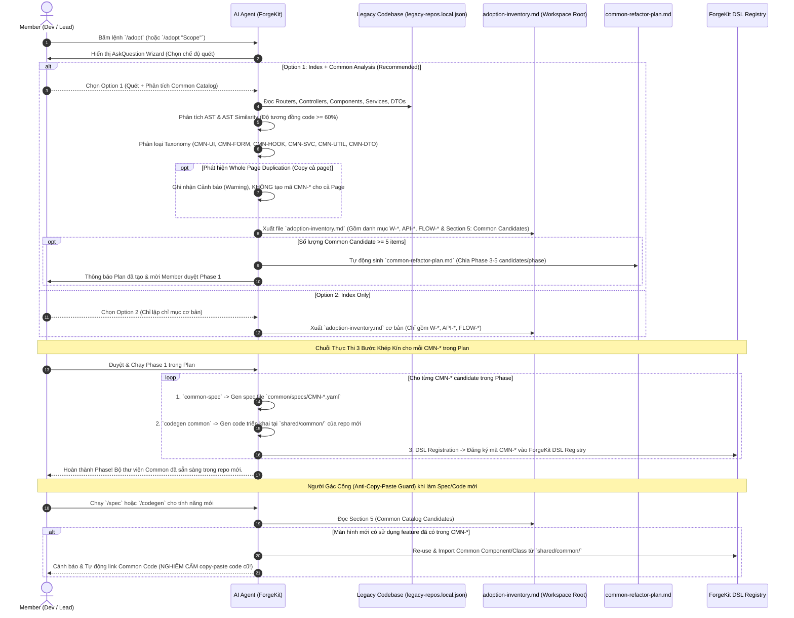

# Hướng Dẫn Quét Khảo Cổ Legacy & Đề Xuất Common Catalog (Anti-Copy-Paste Workflow)

> **Tài liệu SSOT quy định quy trình quét dự án cũ (Legacy System Archaeology), phân tích rà soát lỗ hổng 2 cấp độ (2-Tier Audit), và tự động đề xuất bộ linh kiện/thư viện dùng chung (Common Catalog) ngăn chặn thói quen copy-paste code khi phát triển hệ thống mới.**

---

## 1. Bối Cảnh & Mục Tiêu

Trong các dự án lâu năm (Legacy), hiện tượng **Dev cũ lặp đi lặp lại hành vi copy-paste code** (cả UI Component, Form Section, Custom Hook ở FE lẫn Service Logic, Query Specs, Helper Utility ở BE) diễn ra rất phổ biến. 

Nếu tiếp tục mang tư duy copy-paste này sang hệ thống mới:
- Codebase mới sẽ nhanh chóng bị phình to, phân rã và không thể bảo trì.
- Các sửa đổi về sau phải vá ở hàng chục file lẻ tẻ.

### 🎯 Nguyên Tắc Vận Hành:
1. **Giữ nguyên Legacy Code cũ**: Những phần code cũ chưa có yêu cầu chạm đến thì **giữ nguyên 1:1**, tuyệt đối không tự ý refactor đụng chạm gây rủi ro regression.
2. **Bảo vệ tuyệt đối Codebase mới (Anti-Copy-Paste Guard)**: Khi viết Spec hoặc phát triển tính năng mới (`/spec`, `/codegen`), hệ thống **NGHIÊM CẤM copy-paste code cũ vào các class/file lẻ tẻ mới**. Bắt buộc phải tham chiếu và tái sử dụng bộ danh mục **Common Catalog (`CMN-*`)**.

---

## 2. Mô Hình Rà Soát Legacy 2 Cấp Độ (2-Tier Legacy Audit Framework)

Để tránh việc AI sa đà hoặc báo nhầm lỗ hổng, ForgeKit phân định rạch ròi 2 cấp độ rà soát trong luồng khảo cổ:

| Cấp độ | Lệnh kích hoạt | Scope Rà soát | Chi tiết Nội dung Kiểm tra |
|---|---|---|---|
| **Tier 1: Page / API Detail Audit** | `/legacy /spec W-*` | Nội bộ 1 Màn hình / 1 API | - **Thiếu sót Validation**: Code cũ làm thiếu rule validate field, max length, format regex.<br>- **Local Security**: Kiểm tra `@csrf` trên form, Auth middleware trên router, input sanitization.<br>*(KHÔNG check lỗ hổng nghiệp vụ cross-system ở level này)* |
| **Tier 2: End-to-End Cross-Flow Audit** | `/legacy /business-process` | Quy trình liên màn hình / liên service | - **Flow Gaps & Misalignment**: Step $N$ (Màn 1) trả data/status lệch với input kỳ vọng ở Step $N+1$ (Màn 2).<br>- **Orphan Steps**: API hoặc step mồ côi không được gọi trong flow.<br>- **Flow Resilience**: Thiếu bước confirm, idempotency, hoặc rollback khi giao dịch lỗi. |

---

## 3. Sơ Đồ Tuần Tự Luồng Vận Hành (Sequence Diagram)

Sơ đồ Mermaid dưới đây mô tả chi tiết sự tương tác giữa Member, AI Agent, Legacy Repositories, và ForgeKit Engine từ lúc quét chỉ mục cho đến khi sinh Code Common cho dự án mới:



---

## 4. Chi Tiết Quy Trình Vận Hành 4 Bước

### 📌 Bước 1: Khảo Cổ Lập Chỉ Mục & Chọn Chế Độ (`/adopt`)

Khi gõ `/adopt`, AI Agent kích hoạt Wizard xác nhận:
- **Option 1 (Recommended)**: Quét chỉ mục + Phân tích Đề xuất Common Catalog (Auto-detect code duplication, gom nhóm Common UI/API/DTO).
- **Option 2**: Chỉ quét lập chỉ mục danh mục cơ bản (`Index Only`).

#### Bảng Phân Loại Taxonomy Code Copy-Paste (Khi chọn Option 1):
- 🎨 **Front-End**:
  - `CMN-UI-*`: UI Components bị copy-paste (Custom Data Table, Status Badge, Confirm Modal...).
  - `CMN-FORM-*`: Cụm Form Section bị copy-paste (Cụm nhập Địa chỉ Tỉnh/Huyện/Xã, Customer Contact Info...).
  - `CMN-HOOK-*`: Logic State / Composable lặp lại (Hook `useTable`, `useDebounceSearch`...).
  - `CMN-UTIL-*`: Helper FE (Date Formatter, Currency Parser, Error Toast Mapper...).
- ⚙️ **Back-End**:
  - `CMN-SVC-*`: Business Logic lặp lại ở nhiều Service classes.
  - `CMN-REPO-*`: Query Builder Specs (Filter động, Soft-delete scope, Audit Query...).
  - `CMN-MAPPER-*`: Code transform Entity ↔ DTO thủ công bị lặp đi lặp lại.
  - `CMN-MID-*`: Interceptors / Guards (Audit Logger, Tenant Header Resolver, Permission Check...).
  - `CMN-UTIL-*`: Backend Helpers (Excel Export Engine, PDF Generator, S3 Upload Driver...).

#### ⚠️ Ngoại Lệ: Xử Lý Lặp Cả Màn Hình (Whole Page Duplication):
Nếu dev cũ copy-paste nguyên cả file màn hình (ví dụ `CreateUser.tsx` vs `EditUser.tsx` hoặc 2 trang Form gần giống hệt nhau):
- ❌ **KHÔNG TẠO mã `CMN-*` cho toàn bộ Page** (vì tạo Common cho cả Page là cồng kềnh, vi phạm thiết kế).
- ✅ **CHỈ CẢNH BÁO** vào `adoption-inventory.md` tại mục `### Whole Page Duplication Warnings`.
- Khuyến nghị Member khi làm `/spec` mới gộp chung thành 1 Form Spec đa chế độ (`mode: create | edit`).

---

### 📌 Bước 2: Lập Implementation Plan (`common-plan.md`)

Khi số lượng Common Candidates lớn (≥ 5 items), Agent tự động tạo file `common-plan.md` tại workspace root để chia nhỏ khối lượng công việc:

```markdown
# Common Standardization Implementation Plan

> **Nguồn**: Phân tích từ `adoption-inventory.md`
> **Mục tiêu**: Xây dựng bộ thư viện Common cho dự án mới trước khi phát triển các tính năng chi tiết.

## Phase 1: Core Utilities & Common UI (Ưu tiên cao nhất)
- [ ] **CMN-BE-UTIL-001**: Standard Pagination & Dynamic Sorting Response Wrapper
- [ ] **CMN-FE-UI-001**: Advanced Search & Filter Toolbar Component
- [ ] **CMN-BE-MID-001**: Audit Logging Interceptor

## Phase 2: Form Sections & Data Mappers
- [ ] **CMN-FE-FORM-001**: Address Cascader Selector (Tỉnh/Huyện/Xã)
- [ ] **CMN-BE-MAPPER-001**: Standard Entity-to-DTO Mapper Base Class

## Phase 3: Advanced Helpers
- [ ] **CMN-BE-UTIL-002**: Excel Export Engine
```

---

### 📌 Bước 3: Chuỗi Thực Thi 3 Bước Khép Kín Cho Mỗi Common Candidate

Với từng `CMN-*` được Member duyệt trong Plan, Agent chạy tuần tự 3 bước:

1. **Bước 3.1 (`common-spec`)**: Sinh file Spec chuẩn cho Common (`common/specs/CMN-*.yaml`), định nghĩa rõ Props, Inputs/Outputs, Exception handling, và DSL Schema.
2. **Bước 3.2 (`codegen common`)**: Sinh code triển khai thực tế trong thư mục shared/common của repo mới (`shared/components/`, `shared/services/`, `shared/utils/`).
3. **Bước 3.3 (`DSL Registration`)**: Đăng ký `CMN-*` vào ForgeKit DSL Registry.

---

### 📌 Bước 4: Người Gác Cổng Anti-Copy-Paste Guard (`/spec` & `/codegen`)

Khi phát triển tính năng mới hoặc trích xuất spec từ legacy (`/spec`, `/legacy /spec`):
- Agent tự động đối chiếu thông tin màn hình mới với Section 5 của `adoption-inventory.md`.
- Nếu phát hiện màn hình mới sử dụng các UI Control, API Handler, hoặc DTO đã có trong danh mục Common -> **BẮT BUỘC phải link & import mã `CMN-*` đó**.
- **Tuyệt đối không nhân bản code cũ thành các class/file lẻ tẻ mới.**

---

## 5. Mẫu Kết Xuất `adoption-inventory.md`

```markdown
# Platform Adoption Inventory (Legacy Scan & Common Catalog)

> **Scan Date**: 2026-09-24 | **Sources Config**: `legacy-repos.local.json` | **Common Analysis**: Enabled

## 1. Surfaces
- **Admin Portal** (`surfaces/admin`) → Legacy repo: `admin-fe`

## 2. Modules Catalog (`CMP-*`)
- **CMP-ADM-001**: Auth & Identity Management → Legacy: `admin-fe/src/modules/auth/`

## 3. Screens & API Function Inventory (`W-*`, `API-*`)
### Admin Portal (`surfaces/admin/CMP-ADM-001`)
- **W-AD-AUTH-001**: Login → Legacy: `admin-fe/src/pages/Login.tsx`
- **API-ADM-AUTH-01**: Auth Services → Legacy: `auth-service/src/controllers/AuthController.java`

## 4. Cross-Flow Candidates (`FLOW-*`)
- **FLOW-checkout**: Checkout & Payment Flow → across `CMP-ADM-002` & `CMP-CUS-001`

## 5. Common Catalog Candidates (Anti-Copy-Paste Guard)
> **Purpose**: Reuse for specs and code of new features / spec updates.

### UI Commons (`CMN-UI-*`)
- **CMN-UI-001**: Advanced Search & Filter Toolbar → Duplicated in: `admin-fe/src/pages/Orders.tsx`, `Users.tsx`
- **CMN-UI-002**: Confirm Action Modal → Duplicated in: `admin-fe/src/components/*`

### API & Service Commons (`CMN-API-*`)
- **CMN-API-001**: Paging Response & Dynamic Sorting Wrapper → Duplicated in: `OrderController.java`, `UserController.java`
- **CMN-API-002**: Audit Logging Interceptor → Duplicated in: `auth-service`, `order-service`

### DTO & Data Commons (`CMN-DTO-*`)
- **CMN-DTO-001**: Base Auditable & Soft-Delete Entity → Duplicated across 8 Entities

### ⚠️ Whole Page Duplication Warnings
> **Note**: Do not create `CMN-*` for full pages. Recommend consolidating into a single polymorphic spec (`mode: create | edit`).
- **W-AD-USER-001 (Create User)** & **W-AD-USER-002 (Edit User)**: 95% identical → *Recommendation: Consolidate into single Form Spec `CMP-ADM-USER-FORM`*

---
## 6. Handoff Usage Guide
- `/legacy /spec W-AD-AUTH-001` — spec a legacy screen (MUST reuse CMN-* if applicable)
- `/legacy /business-process FLOW-checkout` — map a legacy flow
```
