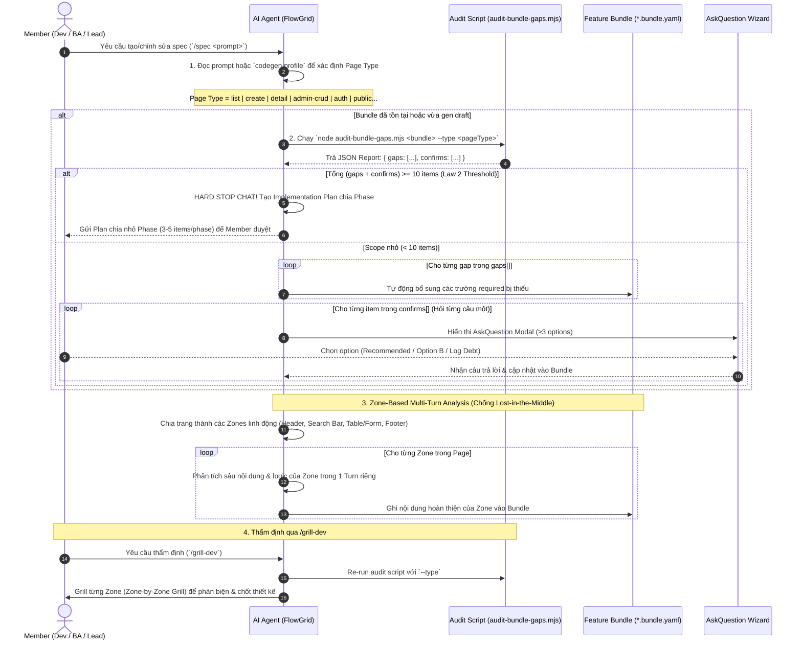

# Hướng Dẫn Quy Trình Spec, Audit Script & Grill Cho Dự Án Mới (Greenfield Spec Workflow)

> **Tài liệu SSOT hướng dẫn chi tiết luồng khởi tạo đặc tả (`/spec`), rà soát tĩnh tự động qua Audit Script với `--type`, phân tích theo Zone chống trôi ngữ nghĩa (Zone-Based Multi-Turn), và thẩm định phản biện (`/grill-dev`).**

---

## 1. Triết Lý Phân Công Trách Nhiệm (Script vs AI Agent)

Để đảm bảo tài liệu đặc tả vừa **đủ về Lượng** vừa **chuẩn về Chất**, FlowGrid áp dụng sự phân công trách nhiệm rạch ròi:

```
        ┌─────────────────────────────────────────────────────────────┐
        │            YÊU CẦU ĐẶC TẢ TÍNH NĂNG (SPEC REQUIREMENT)       │
        └──────────────────────────────┬──────────────────────────────┘
                                       │
                       ┌───────────────┴───────────────┐
                       ▼                               ▼
      ┌─────────────────────────────────┐   ┌─────────────────────────────────┐
      │  DETERMINISTIC SCRIPT (LƯỢNG)   │   │     AI AGENT REASONING (CHẤT)   │
      │  (audit-bundle-gaps.mjs)        │   │     (LLM Intelligence)          │
      ├─────────────────────────────────┤   ├─────────────────────────────────┤
      │ • Kiểm tra SỰ TỒN TẠI của field │   │ • Phân tích nội dung chi tiết   │
      │ • Chạy cực nhanh, 0-dependency  │   │ • Đảm bảo logic nghiệp vụ chuẩn │
      │ • Output JSON: gaps & confirms  │   │ • Kiểm tra tính nhất quán giữa  │
      │ • Bắt buộc truyền --type        │   │   UI controls, API & Testcase   │
      └─────────────────────────────────┘   └─────────────────────────────────┘
```

- **Script Audit (Lượng)**: Đóng vai trò là thước đo định lượng. Trả về 2 danh sách:
  - `gaps[]`: Các trường bắt buộc bị thiếu ➔ Agent tự động bổ sung.
  - `confirms[]`: Các tùy chọn (optional) ➔ Agent dùng AskQuestion wizard hỏi Member.
- **AI Agent (Chất)**: Đóng vai trò là kiến trúc sư. Đảm bảo mô tả nghiệp vụ chuẩn xác, logic liền mạch, không bị đứt đoạn.

---

## 2. Sơ Đồ Tuần Tự Luồng Vận Hành (Sequence Diagram)

Sơ đồ Mermaid dưới đây mô tả luồng làm việc xuyên suốt từ khi bấm `/spec`, qua các bước Audit Interlock, AskQuestion Wizard, Zone Partitioning đến khi hoàn thiện Bundle:



---

## 3. Chi Tiết Quy Trình Vận Hành 4 Bước

### 📌 Bước 1: Xác Định Loại Trang (Page Type Detection)

Trước khi tiến hành audit hoặc sinh spec, Agent **PHẢI** xác định Page Type của màn hình:
1. Đọc trường `gen.codegen.profile` trong file bundle (nếu đã có).
2. HOẶC suy luận từ từ khóa trong prompt:
   - `"danh sách"`, `"list"`, `"bảng dữ liệu"` ➔ `list`
   - `"tạo mới"`, `"form"`, `"nhập liệu"` ➔ `create`
   - `"chi tiết"`, `"detail"`, `"xem"` ➔ `detail`
   - `"đăng nhập"`, `"login"`, `"đổi mật khẩu"` ➔ `auth`
   - `"CRUD"`, `"quản lý danh mục"` ➔ `admin-crud`

---

### 📌 Bước 2: Chạy Audit Interlock Với Tham Số `--type`

Agent gọi script audit tĩnh:
```bash
node engines/spec/lib/audit-bundle-gaps.mjs <path-to-bundle.yaml> --type <pageType>
```

#### Xử Lý Kết Quả Output JSON:
- **`gaps[]` (Lỗi định lượng)**: Các trường required bị thiếu (Title, Summary, Page ID, Screen Access, Columns/Fields, Outcomes Matrix). Agent tự động bổ sung trực tiếp vào bundle.
- **`confirms[]` (Câu hỏi xác nhận)**: Các tính năng optional tùy thuộc vào màn hình (Search bar, Sort, Pagination, Row actions, Bulk actions, Export CSV/Excel, Breadcrumbs). Agent hiển thị qua **AskQuestion Wizard** từng câu một với **≥3 lựa chọn**:
  - `(Recommended) Option đề xuất chuẩn`
  - `Option tùy chọn khác`
  - `Log as Tech Debt (Pending)`

#### 🚨 Vòng Khóa Ngưỡng Khối Lượng (Law 2 Threshold Interlock):
- Nếu script báo **tổng số `gaps[]` + `confirms[]` ≥ 10**: Agent **BẮT BUỘC HARD STOP** trong cửa sổ chat, không được spam câu hỏi đơn lẻ.
- Agent tự động lập một **Implementation Plan** chia nhỏ thành các Phase (3–5 câu hỏi/trường mỗi phase) để xử lý tuần tự.

---

### 📌 Bước 3: Phân Tích Đa Lượt Theo Zone (Zone-Based Multi-Turn Analysis)

Để tránh hiện tượng AI bị "quên ngữ nghĩa ở giữa" (Lost-in-the-Middle) đối với các trang lớn, Agent **không được gửi all-in-one trong một prompt đơn lẻ**, mà phải chia trang thành các **Zone nội dung linh động** dựa trên spec thực tế:

#### Ví dụ Phân Chia Zone Cho Màn Hình Danh Sách (`list`):
- **Zone 1: Header & Context**: Page Title, Breadcrumb, Page ID, Summary, Access Rights.
- **Zone 2: Search & Filter Toolbar**: Search box keyword, Filter drawers, Date range picker, Action buttons (Create, Export).
- **Zone 3: Main Data Table**: Column definitions, Formatters, Status badges, Sortable flags, Row actions (Edit, Delete, View).
- **Zone 4: Footer & Pagination**: Paginator sizes (20/50/100), Bulk actions bar, Empty state configuration.

Agent dành riêng từng Turn giao tiếp để phân tích và hoàn thiện từng Zone trước khi chuyển sang Zone tiếp theo.

---

### 📌 Bước 4: Thẩm Định Độc Lập Qua `/grill-dev` & `/grill-with-docs`

Khi Member yêu cầu rà soát phản biện (`/grill-dev`):
1. **Audit Check**: Agent kích hoạt lại `audit-bundle-gaps.mjs --type <pageType>` để đảm bảo không còn gap kỹ thuật.
2. **Zone-Based Grill**: Agent tiến hành hỏi phản biện từng Zone (Zone-by-Zone Grill) thay vì dồn tất cả câu hỏi vào một lượt:
   - *Hỏi Zone Search*: "Bộ lọc ngày có cần hỗ trợ lọc theo múi giờ UTC không?"
   - *Hỏi Zone Table*: "Cột Số tiền có cần format dạng tiền tệ VND kèm màu âm/dương không?"

---

## 4. Danh Sách Script Audit Đi Kèm Trong Hệ Thống

| Script Name | Mục Đích Audit | Tham Số Bắt Buộc | Output chính |
|---|---|---|---|
| [`audit-bundle-gaps.mjs`](file:///home/vutv/workspace/forgekit/engines/spec/lib/audit-bundle-gaps.mjs) | Audit cấu trúc YAML Spec của màn hình | `--type <pageType>` | `gaps[]`, `confirms[]` |
| [`audit-api-gaps.mjs`](file:///home/vutv/workspace/forgekit/engines/spec/lib/audit-api-gaps.mjs) | Audit hợp đồng API (SLA, Resilience, Errors) | `<path-to-api.yaml>` | `gaps[]` |
| [`audit-testcase-gaps.mjs`](file:///home/vutv/workspace/forgekit/engines/spec/lib/audit-testcase-gaps.mjs) | Audit bao phủ ma trận Testcase | `<path-to-test.yaml>` | `gaps[]` |
| [`audit-flow-gaps.mjs`](file:///home/vutv/workspace/forgekit/engines/spec/lib/audit-flow-gaps.mjs) | Audit 6 phần đặc tả Business Process | `<path-to-FLOW.md>` | `gaps[]` |
| [`audit-legacy-gaps.mjs`](file:///home/vutv/workspace/forgekit/engines/spec/lib/audit-legacy-gaps.mjs) | Audit chỉ mục khảo cổ dự án cũ | `<target-id>` | `gaps[]` |

---

## 5. Verification Checklist Dành Cho Member

- [ ] Page Type đã được xác định chuẩn xác trước khi chạy audit (`list`, `create`, `detail`, `admin-crud`, `auth`).
- [ ] Script `audit-bundle-gaps.mjs` được gọi kèm tham số `--type`.
- [ ] Không có quá 10 câu hỏi spam trong chat (nếu ≥10 item đã có Plan chia Phase).
- [ ] Trang lớn được phân tích theo từng Zone nội dung riêng biệt.
- [ ] Mọi gap về Lượng (Script) và Chất (Agent) đã được giải quyết 100% trước khi chuyển sang bước Codegen.
