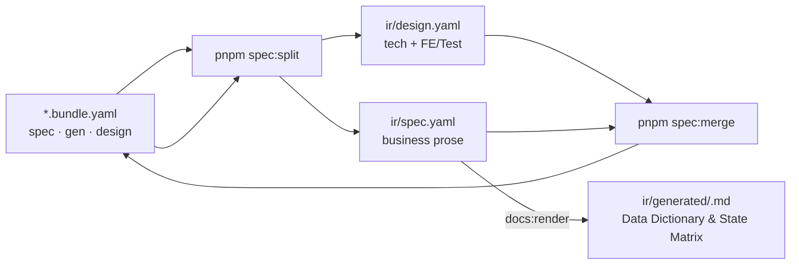

# Bundle ↔ IR split

> Một diagram · [Toolchain index](..)

Không còn `ir/legacy.yaml`. Stub `legacy:` rỗng trên bundle bị bỏ lúc split. Không author `bundle.spec.api` — API SSOT là `api/<seq>/01-backend-spec.yaml`.

## spec vs gen vs design (authoring)

| Section | Chứa | Ai sửa |
|---------|------|--------|
| `bundle.spec` | Actors, requirements, `ui.list\|form\|detail`, acceptance — **không** `spec.api` | `/spec`, `/legacy /spec`, `/grill-bqa` |
| `bundle.gen` | `codegen.profile/entity/module`, `#gen:*`, `ui.filters/columns` | `/grill-dev` |
| `bundle.design` | nav, sections/items (label, meaning, purpose, 5-tier validation, custom widget specs), stateMatrix, actions (6 blocks + 4-tier outcomes) | `/spec` + `/grill-dev` |
| `bundle.review` | Prose BA — **không** split sang ir | `/grill-bqa` |
| `qa/open/QA-<bundle.id>-NNNN.yaml` | Câu hỏi treo (AskQuestion Other chưa chốt) | `/qa-resolve` đóng |

## Split output (đọc theo toolkit)

| File | Độc giả |
|------|---------|
| `ir/design.yaml` | **Bộ Code FE** (`/prototype`, codegen); `api` chiếu slim từ 01 local |
| `ir/spec.yaml` | Business prose (VitePress / publish) — split từ bundle |
| `*.bundle.yaml` | **Authoring SSOT**; **bộ test** `/testcase` đọc **cả bundle** (không tách spec+design IR) |
| `ir/generated/<slug>.md` | Site + `flowgrid publish` — chứa bảng Data Dictionary Table, State & Permission Matrix, Action Flows (không raw YAML dump) |
| `api/<seq>/01-backend-spec.yaml` | **Bộ Code BE** (`/api`) — không đọc `ir/*` |

## Quy tắc edit

**Sửa tay → `*.bundle.yaml` (và/hoặc 01), rồi `pnpm spec:split`.** Không sửa tay `ir/*`.

- Split **ghi đè** `ir/design.yaml` + `ir/spec.yaml`.
- Grill ghi bundle / 01 rồi split. Merge đẩy `gen`/layout về bundle khi cần.

## FlowGrid Docs aliases

| Lệnh | Mục đích |
|------|----------|
| `pnpm spec:split -- <bundle.yaml>` · `flowgrid split` | bundle → `ir/design.yaml` + `ir/spec.yaml` (+ MD `ir/generated`) |
| `pnpm spec:merge -- <bundle.yaml>` · `flowgrid merge` | `ir/*` → bundle |
| `pnpm spec:split:check` · `flowgrid check` | CI: ir sync bundle; common yaml **bắt buộc** có `ir/design.yaml` |
| `pnpm flowgrid:render` · `flowgrid render` | `ir/spec.yaml` → `ir/generated/*.md`; luôn ghi `qa/index.md` |
| `pnpm flowgrid:publish` · `flowgrid publish` | `CATALOG.md` + link đầu README (không render lại spec) |
