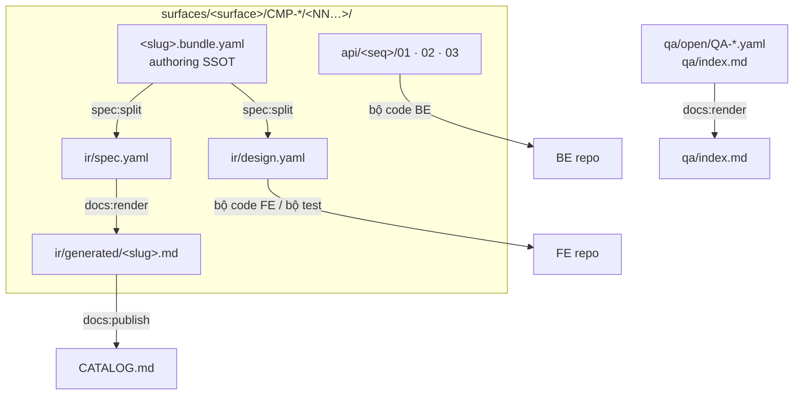

# Artifact layout — leaf màn + API trio

> Một diagram · [Toolchain index](..)

**Không** `modules/` trên path vật lý, **không** `code/W-*` / `code/API-*` sát leaf. Numeric cluster: `CMP-*/01/01/01/`.

## Quy tắc path

| Path | Vai trò |
|------|---------|
| `*.bundle.yaml` | Authoring SSOT (business + tech trên cùng file) |
| `ir/design.yaml` | Tech IR — **input FE bộ code + bộ test** |
| `ir/spec.yaml` | Business inventory — VitePress đọc qua `ir/generated` |
| `ir/generated/<slug>.md` | Markdown site / GitHub catalog |
| `api/<seq>/01-backend-spec.yaml` | **API SSOT** (một API / một primary entity) |
| `api/<seq>/02-openapi.yaml` | `flowgrid openapi_gen` |
| `surfaces/…/common/yaml/` | LCA common (FE bundle + `ir/design.yaml`; API common = trio tại slug) |
| `architecture/03-business-process/FLOW-*.md` | Catalog FLOW; module-internal: `…/common/processes/FLOW-*.md` |
| `qa/open/` · `qa/index.md` | Inbox + list (render luôn ghi list, kể cả rỗng) |
| `CATALOG.md` | Mục lục GitHub — `pnpm flowgrid:publish` |

Pattern CRUD: `templates/shared/patterns/admin-crud.pattern.yaml` (thư mục `templates/` ở repo sau `flowgrid init`).
