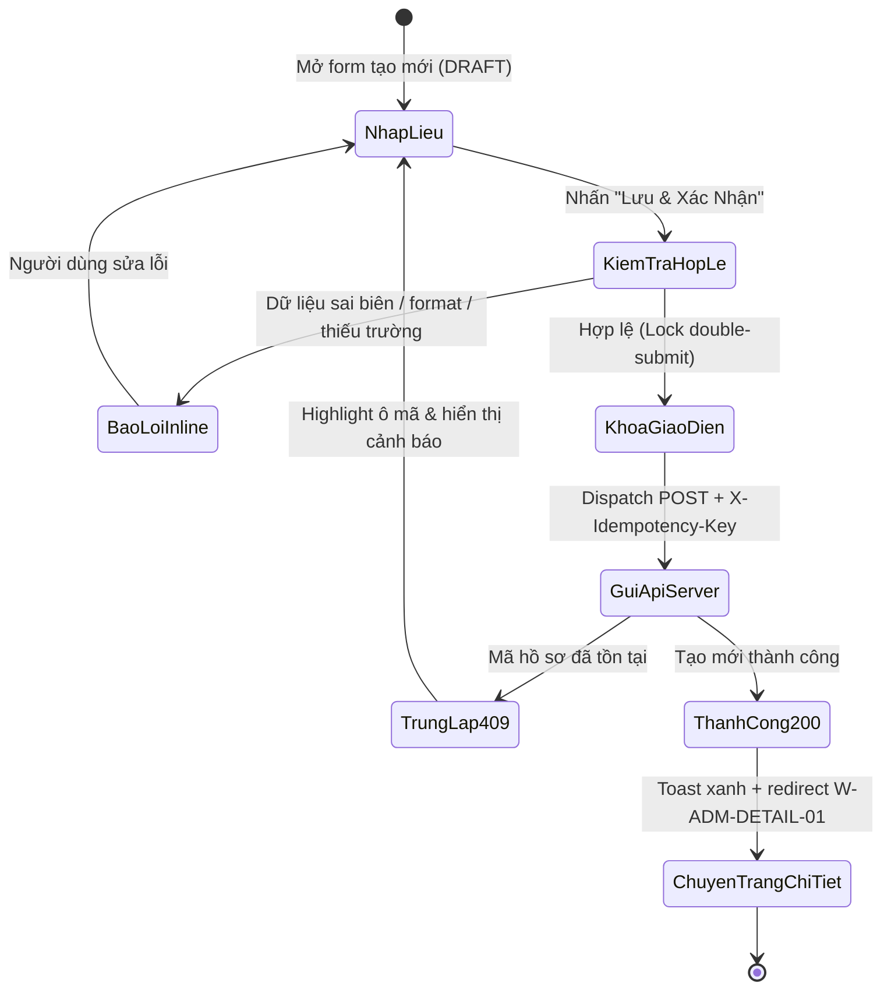

# SC-EXAMPLE — Xác Thực & Khởi Tạo Hồ Sơ Khách Hàng

Scenario thuộc **CMP-01-auth** · Tính năng năng lực **CAP-AUTH-001**.  
Quy tắc chi tiết và schema cơ sở dữ liệu tham chiếu tại **Docs Hub** (cite ID: `spec.yaml`).

| Thuộc tính | Giá trị |
|---|---|
| **Scenario ID** | `SC-EXAMPLE` |
| **Module** | `CMP-01-auth` |
| **Bề mặt (Surface)** | `admin` |
| **Màn hình (Screen)** | `W-AD-AUTH-001` (`/admin/records/create`) |
| **Mức độ ưu tiên** | `High` |

## 1. Bối Cảnh Nghiệp Vụ & Phân Tích Rủi Ro (Business Context & Risk Analysis)

Màn hình khởi tạo hồ sơ là cửa ngõ dữ liệu tài chính của khách hàng. Nếu bỏ sót kiểm tra trùng mã hoặc không xử lý chặn click đúp (double-submit), hệ thống sẽ tạo các bản ghi rác gây xung đột số liệu doanh thu và vi phạm tính toàn vẹn dữ liệu kế toán.

## 2. Hành Vi Chuẩn BDD (Behavior: Given / When / Then)

- **Given (Tiền điều kiện):** Người dùng đăng nhập thành công với vai trò Quản trị viên (`ADMIN`), tài khoản có quyền `records.create`, và chưa tồn tại bản ghi nào có mã `REC-2026-001` trong cơ sở dữ liệu.
- **When (Thao tác):** Người dùng nhập đầy đủ các trường thông tin hợp lệ (mã hồ sơ, tên hồ sơ, chọn gói dịch vụ) và nhấn nút "Lưu & Xác Nhận".
- **Then (Hậu điều kiện):** Hệ thống khóa nút để tránh gửi trùng lặp, gửi request kèm header `X-Idempotency-Key`, tạo mới bản ghi thành công trong bảng `records`, hiển thị Toast thông báo màu xanh và điều hướng sang màn hình chi tiết `W-ADM-DETAIL-01`.

## 3. Ma Trận Test Phân Hoạch Tương Đương & Phân Tích Giá Trị Biên (Equivalence Partitioning & Boundary Test Matrix - IEEE 29119)

| Mã Case (Case ID) | Khía Cạnh Kiểm Thử (Facet) | Dữ Liệu Đầu Vào (Input Data) | Kết Quả Mong Đợi (Expected Outcome) | HTTP Status & UI State | Tự Động Hóa (Automation Case) |
|---|---|---|---|---|---|
| **TC-VAL-01** | `positive_boundary` (Biên tối thiểu) | `code: "REC01"` (5 chars), `name: "Hồ sơ A"` | Form hợp lệ, gửi dữ liệu thành công | `HTTP 200` · Toast Success xanh | `TC-EXAMPLE-VALID` |
| **TC-VAL-02** | `positive_boundary` (Biên tối đa) | `code: "REC-2026-MAXIMUM-001"` (20 chars) | Form hợp lệ, gửi dữ liệu thành công | `HTTP 200` · Toast Success xanh | `TC-EXAMPLE-VALID` |
| **TC-VAL-03** | `negative_length` (Dưới độ dài min) | `code: "REC"` (3 chars) | Chặn submit, báo lỗi inline dưới ô nhập | `Client Error` · "Độ dài từ 5 đến 20 ký tự" | `TC-EXAMPLE-INVALID` |
| **TC-VAL-04** | `negative_format` (Sai regex ký tự) | `code: "rec_code_@!"` (chữ thường, ký tự lạ) | Chặn submit, báo lỗi inline dưới ô nhập | `Client Error` · "Chỉ gồm chữ in hoa, số và gạch" | `TC-EXAMPLE-INVALID` |
| **TC-VAL-05** | `negative_duplicate` (Trùng lặp DB) | `code: "REC-EXISTING-001"` (đã có trong DB) | Server từ chối, highlight viền đỏ ô mã | `HTTP 409` · Toast Cảnh báo trùng lặp | `TC-EXAMPLE-DUPLICATE` |
| **TC-ACT-06** | `concurrency_double_submit` | Click nút "Lưu" liên tục 2 lần trong 100ms | Nút khóa disabled tức thì, chỉ 1 request gửi đi | `UI Locked` · Không tạo 2 bản ghi trùng | `TC-EXAMPLE-CONCURRENCY` |
| **TC-SYS-07** | `network_interruption` (Mất mạng) | Ngắt kết nối mạng ngay khi gửi request | Hiện banner cảnh báo mất kết nối, giữ nguyên dữ liệu form | `Network Banner` · Form state preserved | `TC-EXAMPLE-OFFLINE` |

## 4. Bao Phủ Rủi Ro & Khía Cạnh Chất Lượng (Quality Dimensions Coverage)

| Khía Cạnh (Dimension) | Mức Độ Bao Phủ | Ghi Chú Đảm Bảo Chất Lượng |
|---|---|---|
| **Happy Path & Workflow** | 100% | Toàn bộ luồng khởi tạo đến xem chi tiết hoàn tất |
| **Boundary Value Analysis** | 100% | Kiểm thử đầy đủ tại ngưỡng min-1, min, max, max+1 |
| **Data Integrity & Concurrency** | 100% | Kiểm tra unique mã hồ sơ qua async DB & chặn double-click |
| **Security & RBAC** | 100% | Kiểm soát phân quyền nút bấm theo ma trận trạng thái |
| **Fault Tolerance & Resilience** | 100% | Xử lý mất mạng giữ dữ liệu, xử lý timeout không resubmit trùng |

## 5. Danh Sách Test Cases Chi Tiết (Test Cases Mapping)

| Mã Case (ID) | Khía Cạnh | Mức Độ Ưu Tiên | Thư Mục Test Hub |
|---|---|---|---|
| `TC-EXAMPLE-VALID` | happy, boundary | Critical | `cases/admin/CMP-01-auth/01/create/` |
| `TC-EXAMPLE-INVALID` | validation, boundary | High | `cases/admin/CMP-01-auth/01/create/` |
| `TC-EXAMPLE-DUPLICATE` | concurrency, remote_unique | High | `cases/admin/CMP-01-auth/01/create/` |
| `TC-EXAMPLE-CONCURRENCY` | interaction, double_submit | High | `cases/admin/CMP-01-auth/01/create/` |
| `TC-EXAMPLE-OFFLINE` | reliability, offline_resilience | Medium | `cases/admin/CMP-01-auth/01/create/` |
