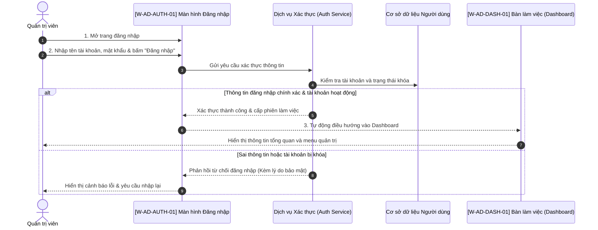

# FLOW-LOGIN: Quy trình Đăng nhập Quản trị viên

---

## 1. Bối cảnh & Ma trận Phân quyền Nghiệp vụ

* **Bối cảnh kích hoạt:** Quản trị viên truy cập vào cổng quản trị để quản lý hệ thống. Phiên đăng nhập hiện tại chưa có hoặc đã hết hạn.
* **Ma trận Vai trò & Quyền hạn:**
  | Tác nhân (Actor) | Vai trò trong Quy trình | Quyền hạn trên Màn hình |
  | :--- | :--- | :--- |
  | **Quản trị viên (Admin)** | Đăng nhập tài khoản | Nhập thông tin trên `[W-AD-AUTH-01]`, truy cập `[W-AD-DASH-01]` |

---

## 2. Chuỗi User Stories Đa Tầng

### Story 1: Xác thực & Truy cập Hệ thống (Primary Action Story)
> **Là một** Quản trị viên hệ thống,  
> **Tôi muốn** nhập tên đăng nhập và mật khẩu hợp lệ trên màn hình đăng nhập `[W-AD-AUTH-01]`,  
> **Để** hệ thống xác thực danh tính và cấp quyền truy cập vào trang tổng quan `[W-AD-DASH-01]`.

### Story 2: Xử lý Sai Thông tin & Khóa Tài khoản (Security Fallback Story)
> **Là một** Quản trị viên hệ thống,  
> **Tôi muốn** nhận được thông báo lỗi rõ ràng nếu nhập sai thông tin đăng nhập,  
> **Để** tôi biết và điều chỉnh lại, đồng thời hệ thống tự động khóa tạm thời nếu nhập sai quá số lần quy định nhằm bảo mật thông tin.

*(Quy trình này thuần tương tác màn hình xác thực, không có tác vụ background job ngầm).*

---

## 3. Quy tắc Nghiệp vụ (Business Rules) & Vòng đời Trạng thái

### Danh mục Quy tắc Nghiệp vụ
* **BR-01 (Giới hạn thử lại):** Cho phép nhập sai tối đa 5 lần liên tiếp. Nếu vượt quá, khóa tài khoản tạm thời trong 15 phút.
* **BR-02 (Thời hạn phiên làm việc):** Phiên làm việc (Session) duy trì tối đa 8 giờ hoặc tự động đăng xuất sau 30 phút không có thao tác.
* **BR-03 (Bảo mật thông báo):** Khi đăng nhập thất bại, chỉ hiển thị thông báo chung: "Tên đăng nhập hoặc mật khẩu không chính xác", không tiết lộ tài khoản có tồn tại hay không.

### Ma trận Chuyển đổi Trạng thái
| Thực thể | Trạng thái Bắt đầu | Hành động kích hoạt | Trạng thái Kết thúc | Điều kiện |
| :--- | :--- | :--- | :--- | :--- |
| **Phiên làm việc** | `UNAUTHENTICATED` | Nhập đúng thông tin & bấm "Đăng nhập" | `AUTHENTICATED` | Tài khoản hợp lệ, chưa bị khóa |
| **Tài khoản** | `ACTIVE` | Nhập sai liên tiếp 5 lần | `LOCKED_TEMPORARY` | Vi phạm BR-01 |

---

## 4. Đặc tả Chi tiết Hành trình Từng Chặng

### Chặng 1: Nhập thông tin trên `[W-AD-AUTH-01]`
1. **Thao tác:** Quản trị viên mở trang đăng nhập, điền `username` và `password`.
2. **Bấm "Đăng nhập":**
   * Hệ thống kiểm tra xác thực thông tin đối soát với cơ sở dữ liệu tài khoản.
   * **Nếu hợp lệ:** Khởi tạo phiên làm việc an toàn, điều hướng sang `[W-AD-DASH-01] Dashboard`.
   * **Nếu sai thông tin:** Giữ nguyên màn hình đăng nhập, xóa trắng trường mật khẩu và hiển thị cảnh báo đỏ theo BR-03.

---

## 5. Ma trận Đối chiếu (Traceability Matrix)

| Bước trong User Story | Màn hình liên quan | Hành động trên Sequence Diagram | Thành phần kỹ thuật đảm nhiệm |
| :--- | :--- | :--- | :--- |
| **Story 1 (Đăng nhập)** | `[W-AD-AUTH-01]` | `Admin ->> W_Auth ->> Core: Xác thực` | Auth Service, User Table |
| **Story 1 (Điều hướng)** | `[W-AD-DASH-01]` | `W_Auth -->> W_Dash: Mở Dashboard` | Router & Session Storage |
| **Story 2 (Sai mật khẩu)** | `[W-AD-AUTH-01]` | `W_Auth -->> Admin: Báo lỗi` | Form State & Error Alert |

---

## 6. Sơ đồ Tuần tự Nghiệp vụ Liên Màn hình (Screen-to-Screen Sequence Diagram)

