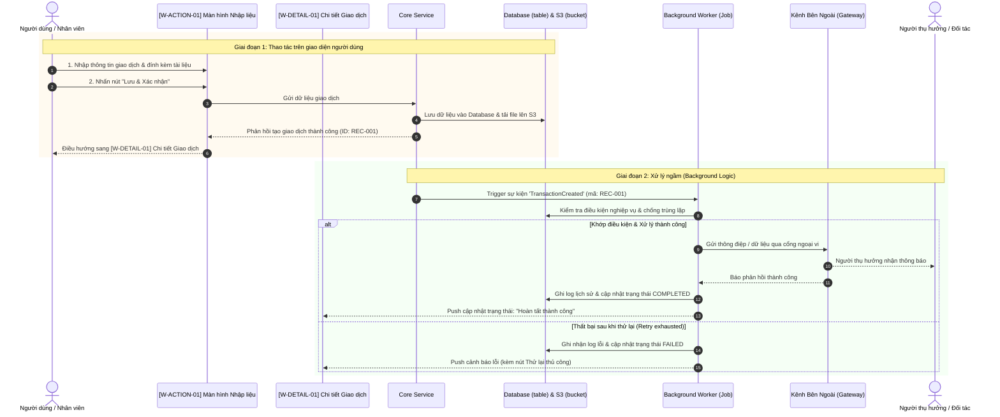

# FLOW-TEMPLATE: [Tên Quy Trình Nghiệp Vụ]

---

## 1. Bối cảnh & Ma trận Phân quyền Nghiệp vụ (Context & Role Matrix)

* **Bối cảnh kích hoạt (Trigger Context):** [Mô tả hoàn cảnh hoặc sự kiện nào khiến quy trình này diễn ra. Ví dụ: Khách hàng yêu cầu đặt hàng, hoặc quản trị viên khởi tạo chiến dịch khuyến mãi...]
* **Mục tiêu kinh doanh (Business Goal):** [Giá trị kinh doanh hoặc bài toán mà quy trình này giải quyết...]
* **Ma trận Vai trò & Quyền hạn (Role & Permission Matrix):**
  | Tác nhân (Actor) | Vai trò trong Quy trình | Quyền hạn trên Màn hình |
  | :--- | :--- | :--- |
  | **[Tác nhân chính]** | [Thực hiện thao tác chính] | [Quyền CRUD trên màn hình W-*] |
  | **[Tác nhân phụ/phê duyệt]** | [Xem xét / phê duyệt / thụ hưởng] | [Xem báo cáo / nhận thông báo] |
  | **[Background Job Worker]* | [Tự động xử lý ngầm sau khi lưu] | [Tự động đọc dữ liệu & gửi thông điệp] |

*(Ghi chú: Nếu quy trình KHÔNG có background logic, có thể lược bỏ dòng Background Job Worker).*

---

## 2. Chuỗi User Stories Đa Tầng (Multi-tiered User Stories)

### Story 1: Thao tác Chuẩn bị / Cấu hình (Setup Story - Tùy chọn)
> **Là một** [Vai trò chuẩn bị, vd: Quản trị viên],  
> **Tôi muốn** [Hành động cấu hình trên màn hình W-SET-01],  
> **Để** [Mục đích chuẩn bị cho các bước giao dịch tiếp theo].

### Story 2: Thao tác Nghiệp vụ Chính (Primary Action Story)
> **Là một** [Vai trò người dùng, vd: Nhân viên vận hành / Khách hàng],  
> **Tôi muốn** [Nhập liệu và gửi yêu cầu trên màn hình W-ACTION-01],  
> **Để** [Hoàn tất thủ tục giao dịch nghiệp vụ].

### Story 3: Xử lý Tự động Ngầm (Automated System Story - Khi có Background Logic)
> **Là một** Hệ thống Tự động (Background Job Worker),  
> **Tôi muốn** tự động bắt sự kiện lưu đơn, so khớp điều kiện và điều phối lệnh xử lý tới [Kênh đích / Cổng đối tác],  
> **Để** tự động hóa quy trình, giảm thiểu độ trễ và tránh sai sót thao tác thủ công, đồng thời đảm bảo không xử lý lặp lại (Idempotency).

### Story 4: Giám sát Trạng thái & Xử lý Ngoại lệ (Tracking & Fallback Story)
> **Là một** [Vai trò người dùng / Quản lý],  
> **Tôi muốn** theo dõi tiến độ và trạng thái xử lý trên màn hình chi tiết `[W-DETAIL-01]`,  
> **Để** nắm bắt kết quả tức thì và can thiệp xử lý thủ công (Fallback) nếu hệ thống gặp sự cố.

---

## 3. Quy tắc Nghiệp vụ (Business Rules) & Vòng đời Trạng thái

### Danh mục Quy tắc Nghiệp vụ (Business Rules)
* **BR-01 (Quy tắc thẩm định dữ liệu):** [Mô tả điều kiện hợp lệ để cho phép đi tiếp sang bước kế tiếp...]
* **BR-02 (Quy tắc ưu tiên / giới hạn):** [Ví dụ: Thứ tự ưu tiên bộ lọc, hạn mức giao dịch tối đa...]
* **BR-03 (Chính sách Retry khi xử lý ngầm):** [Nếu có Job: Số lần thử lại (vd: tối đa 3 lần), khoảng cách thời gian giữa các lần, và điều kiện hủy bỏ khi gặp lỗi client 4xx.]
* **BR-04 (Bảo mật & Lưu trữ):** [Quy tắc lưu trữ file trên S3, thời hạn link presigned URL hoặc chính sách bảo mật dữ liệu cá nhân.]

### Ma trận Chuyển đổi Trạng thái (State Transitions)
| Thực thể (Entity) | Trạng thái Bắt đầu | Hành động / Sự kiện kích hoạt | Trạng thái Kết thúc | Điều kiện chuyển trạng thái |
| :--- | :--- | :--- | :--- | :--- |
| **[Thực thể chính]** | `DRAFT` / `NONE` | Bấm "Lưu" trên `[W-ACTION-01]` | `CREATED` | Dữ liệu form hợp lệ |
| **[Tác vụ ngầm/Job]** | `PENDING_TRIGGER` | Backend bắn sự kiện kích hoạt | `PROCESSING` | Worker nhận job từ queue |
| **[Tác vụ ngầm/Job]** | `PROCESSING` | Xử lý thành công (cổng trả 200) | `COMPLETED` / `SENT` | Khách nhận tin / Đơn cập nhật |
| **[Tác vụ ngầm/Job]** | `PROCESSING` | Thất bại sau tối đa lượt retry | `FAILED` | Bật cảnh báo lỗi trên màn hình |

---

## 4. Đặc tả Chi tiết Hành trình Từng Chặng (Step-by-step Journey)

### Chặng 1: Thao tác & Nhập liệu trên Màn hình `[W-ACTION-01]`
1. **Thao tác người dùng:** Người dùng truy cập form, điền các thông tin bắt buộc.
2. **Dữ liệu nhập (Key fields):**
   * Field A: `[Tên trường]` = `[Giá trị mẫu]`
   * Field B: `[Tên trường]` = `[Giá trị mẫu]`
3. **Bấm "Lưu & Xác nhận":**
   * *Kiểm tra tại chỗ:* Hệ thống validate dữ liệu giao diện.
   * *Lưu trữ:* Ghi nhận thông tin vào Database (Table: `[tên_table]`), tải file đính kèm lên S3 Bucket `[tên_bucket]`.
   * *Chuyển màn hình:* Điều hướng người dùng sang `[W-DETAIL-01]`.

### Chặng 2: Xử lý Ngầm Phía Sau (Background Logic Execution - Nếu có)
1. **Kích hoạt sự kiện:** Backend bắn sự kiện `[EventName]` kèm ID thực thể.
2. **Worker xử lý:** Background Job quét điều kiện so khớp:
   * *Kiểm tra Idempotency:* Đảm bảo chưa từng xử lý sự kiện này trước đó.
   * *So khớp quy tắc:* Đối chiếu với BR-01 và BR-02.
3. **Thực thi giao tiếp:** Gọi cổng ngoại vi / dịch vụ thứ 3 (Zalo/SMS/Email/Partner Webhook).
4. **Cập nhật kết quả:** Ghi nhận log vào table `[tên_log_table]`, cập nhật trạng thái đơn thành `COMPLETED` (hoặc `FAILED` nếu vượt quá số lần retry).

### Chặng 3: Phản hồi Trạng thái trên Màn hình `[W-DETAIL-01]`
1. **Hiển thị kết quả:** Màn hình cập nhật badge trạng thái (Xanh: Thành công / Đỏ: Thất bại kèm lý do).
2. **Cơ chế phục hồi (Fallback):** Nếu trạng thái là thất bại, hiển thị nút bấm `[Thử lại thủ công]` để người dùng kích hoạt lại mà không cần nhập lại form.

---

## 5. Ma trận Đối chiếu (Traceability Matrix)

| Bước trong User Story | Màn hình liên quan | Hành động trên Sequence Diagram | Thành phần kỹ thuật đảm nhiệm |
| :--- | :--- | :--- | :--- |
| **Story 1 (Setup)** | `[W-SET-01]` | `Admin ->> W_Set ->> Core: Lưu cấu hình` | Table cấu hình |
| **Story 2 (Primary Action)** | `[W-ACTION-01]` | `User ->> W_Action ->> Core: Gửi dữ liệu` | Core Service, Table chính, S3 |
| **Story 3 (Background Job)** | N/A (Chạy ngầm) | `Core ->> Job ->> Gateway: Xử lý ngầm` | Background Worker, Message Queue |
| **Story 4 (Tracking)** | `[W-DETAIL-01]` | `Job -->> W_Detail: Push trạng thái` | UI Detail Screen, Log Table |

---

## 6. Sơ đồ Tuần tự Nghiệp vụ Liên Màn hình (Screen-to-Screen Business Sequence Diagram)

